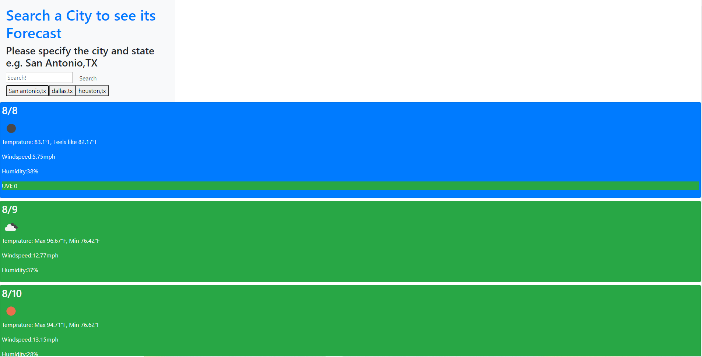

# Weather-Forecast-App

first my app takes input from search input from search-input an enters it into the geocodingAPI url
this gets lat and lon and feeds that to search onecall().
takes lat and long a puts that into the onecall url and feeds the city name into show results
Show results gets the data and creates cards for the different data and gets data from onecall.
it populates cards with data and styles uvi according to its level.
clears previously displayed weather cards or "nukes" them by removing child nodes
creates search history buttons with search history input as its text and value.
gets info from local storage and recreates buttons with their textContent and value
loops through local storage creating buttons with values from localstorage
creates search history button and nukes previous cards
sets search input into local storage creates historyBtn and searchsgeo with its value
